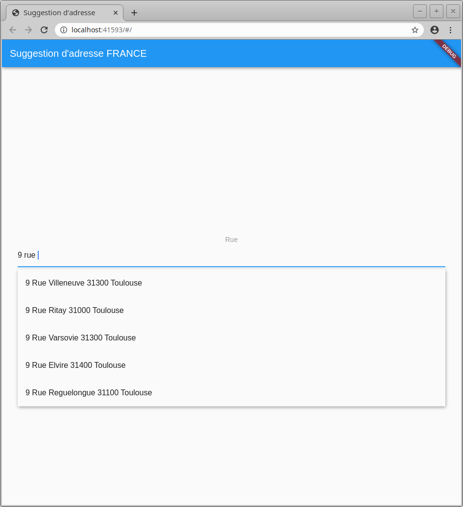

<h1 align="center">Welcome to suggestion_adresse_FR 👋</h1>
<p>
  
</p>

> Champ de formulaire permettant d'autocompléter une adresse GRATUITEMENT avec comme source de données l'[API Adresse du gouvernement](https://geo.api.gouv.fr/adresse).




## Install

```sh
flutter run
```

## Author

👤 **Louis Chovaneck**

* Github: [@louia](https://github.com/louia)
* LinkedIn: [Louis Chovaneck](https://linkedin.com/in/louis-chovaneck-434142172)

## Show your support

Give a ⭐️ if this project helped you!

***
_This README was generated with ❤️ by [readme-md-generator](https://github.com/kefranabg/readme-md-generator)_